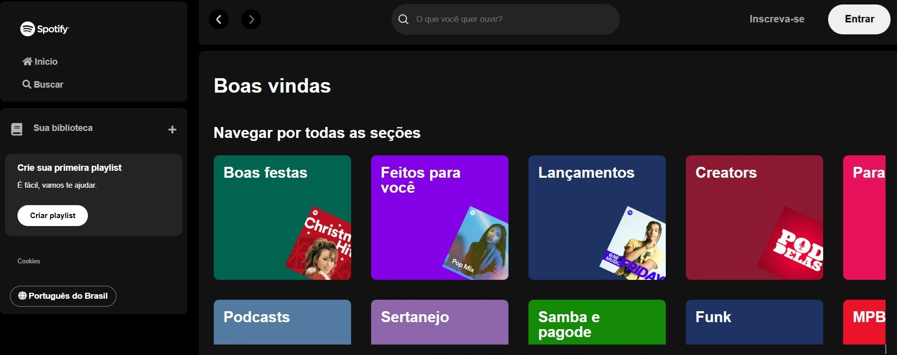

# 🎵 Spotify Interface Clone - Imersão Alura



Clone responsivo da interface do Spotify desenvolvido como projeto educativo durante a Imersão Alura, implementando as principais funcionalidades visuais da plataforma.

## 🌟 Recursos Principais

### 🎨 Interface Fiel
- Barra lateral com menu de navegação completa
- Biblioteca musical interativa
- Seção de criação de playlists
- Barra superior com controles de navegação e busca

### 🎶 Conteúdo Musical
- 15 cards de playlists categorizadas por gênero:
  - Boas festas
  - Feitos para você
  - Lançamentos
  - Para treinar
  - Sertanejo
  - Rock
  - Hip Hop
  - Entre outros

### ✨ Funcionalidades Dinâmicas
- Saudação automática (Bom dia/Tarde/Noite)
- Barra de pesquisa integrada
- Seção de artistas com hover effects
- Chamada para assinatura Premium

## 🛠 Stack Tecnológica

| Categoria       | Tecnologias                                                                 |
|-----------------|----------------------------------------------------------------------------|
| **Frontend**    | HTML5, CSS3 (Flexbox/Grid), JavaScript Vanilla                             |
| **Design**      | Responsivo (Mobile First), Variáveis CSS, Media Queries                   |
| **Ícones**      | Font Awesome v5.15.4                                                       |
| **Organização** | CSS Modularizado (6 arquivos separados)                                    |

## 📁 Estrutura do Projeto

```plaintext
spotify-clone/
│
├── index.html                # Página principal
├── src/
│   ├── assets/
│   │   ├── icons/            # Ícones da interface
│   │   │   ├── favicon.png
│   │   │   ├── logo-spotify.png
│   │   │   ├── small-left.png
│   │   │   ├── small-right.png
│   │   │   └── search.png
│   │   │
│   │   └── playlist/         # Capas das playlists
│   │       ├── 1.jpeg        # Boas festas
│   │       ├── 2.png         # Feitos para você
│   │       ├── 3.jpeg        # Lançamentos
│   │       └── ...           # +12 categorias
│   │
│   └── styles/               # Estilos organizados
│       ├── reset.css         # Reset CSS
│       ├── vars.css          # Variáveis globais
│       ├── main-content.css  # Estilos do conteúdo
│       ├── sidebar-footer.css # Barra lateral/rodapé
│       └── media-query.css   # Responsividade
│
├── script.js                 # Lógica principal
├── search.js                 # Funções de busca
└── README.md                 # Documentação
```

# 🚀 Instalação e Execução

**Clonar repositório:**

```bash
git clone https://github.com/seu-usuario/spotify-clone.git
```

**Acessar diretório:**

```bash
cd spotify-clone
```

**Abrir no navegador:**

- Duplo clique no `index.html` ou

**Servidor local:**

```bash
python -m http.server 8000
```

Acesse: http://localhost:8000

---

# 🔍 Funcionalidades JavaScript

### `script.js`

- Detecta horário do usuário para exibir saudação adequada  
- Gerencia interações básicas da UI  
- Controle de eventos dos elementos  

### `search.js`

- Implementa sistema de busca simulada  
- Alterna entre views:
  - `result-playlists` (padrão)
  - `result-artist` (busca)
- Efeitos hover nos cards de artista

---

# 📱 Responsividade

**Breakpoints implementados:**

- > 1440px: Desktop XL  
- 1024px–1440px: Desktop padrão  
- 768px–1024px: Tablets  
- < 768px: Smartphones  

**Técnicas utilizadas:**

- Media Queries em arquivo dedicado  
- Unidades relativas (`rem`, `%`, `vh/vw`)  
- Flexbox para layouts fluidos  
- Grid para disposição de cards  

---

# 🛠 Melhorias Futuras

| Prioridade | Melhoria                         | Status     |
|-----------:|----------------------------------|------------|
| Alta       | Player de música funcional       | ⌛ Pendente |
| Alta       | Login com API do Spotify         | ✨ Planejado |
| Média      | Dark Mode                        | 🗓 Futuro   |
| Baixa      | Animações CSS mais elaboradas    | 💡 Ideia    |

---

# 📜 Licença e Créditos

**Aviso Legal:**  
Este projeto é um clone educativo. Todos os direitos da marca Spotify pertencem à Spotify AB.

**Desenvolvedor:** [Lucas Ramos]  
**Instituição:** Alura - Imersão Frontend  
**Data:** [02/2025]

```
Copyright © [2025] [srloga]
```

- Permitido para fins educacionais e de portfólio.  
- Proibido uso comercial.  

**Nota do Desenvolvedor:**  
Projeto desenvolvido com foco em boas práticas de frontend,  
organização de código e responsividade durante a Imersão Alura.
